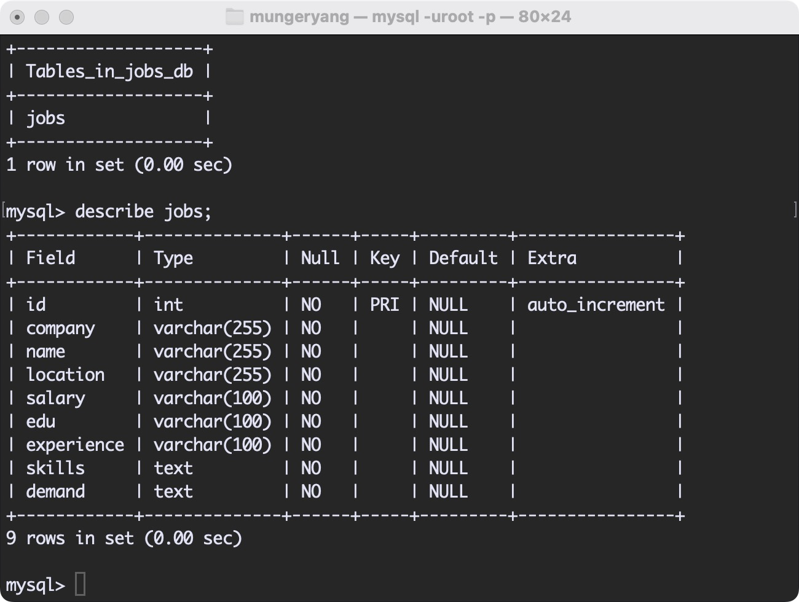

# 基于Scrapy的boss直聘岗位信息爬取

Crawling boss.com position information based on Scrapy-基于Scrapy的boss直聘岗位信息爬取(2024最新)

## 开发框架及版本

Scrapy                             2.6.2

requests                           2.28.1

selenium                          3.141.0

lxml                                 4.9.1

## 难点

boss直聘网站结构相比于前几年的改进：（B站教程均为老版网站）

- 岗位页动态加载
- 详情页动态加载
- ip封锁

程序难点：

- parse函数的请求传参
- 分页爬取
- Downloader中间件编写
- selenium模拟
- 双管道存储(CSV AND MYSQL)

## 爬取结果

数据库-表建立

数据导出csv

## 联系我

:e-mail:jianghuxiaomiao666@163.com

